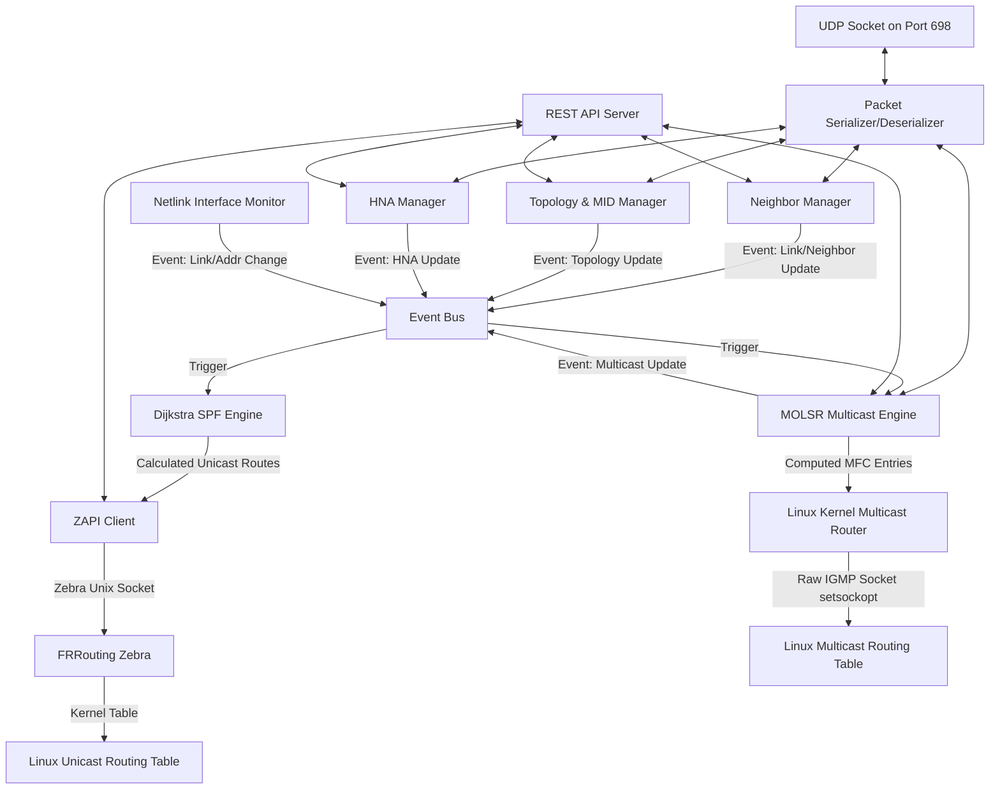

# olsrd-go: OLSR Routing Daemon in Go

[](https://github.com/shjtmy/olsr-go/actions/workflows/ci.yml)
[](https://goreportcard.com/report/github.com/shjtmy/olsr-go)
[](LICENSE)
[](go.mod)

`olsrd-go` is a Go-based implementation of the **Optimized Link State Routing Protocol (OLSR)** (RFC 3626). It integrates with **FRRouting (FRR) Zebra** for unicast route propagation and directly interacts with the Linux kernel's multicast routing subsystem (`ipmr`) to support Multicast OLSR (MOLSR).

---

## System Architecture

The daemon uses an event-driven design communicating via an internal event bus. The subsystems and their interactions are illustrated below:



---

## Core Routing Concepts & Logic

### 1. Unicast Routing

- **Link Sensing**: `HELLO` packets are periodically broadcasted to detect 1-hop neighbors and establish symmetric/asymmetric link states.
- **MPR Selection**: Multi-Point Relays (MPRs) are selected dynamically. Each node chooses a minimal subset of symmetric 1-hop neighbors that provides coverage to all symmetric 2-hop neighbors. This subset is responsible for retransmitting flooded topology control messages.
- **Topology Control (TC) and MID**: Link-state information is flooded using `TC` messages. Nodes with multiple interfaces advertise bindings using `MID` messages. HNA gateways advertise external networks via `HNA` messages.
- **SPF Engine**: Dijkstra's algorithm computes the shortest path tree using symmetric links in the topology database. Paths are generated to both internal mesh nodes and external HNA networks.
- **ZAPI Integration**: Routes are sent to FRRouting Zebra over Unix domain sockets using ZAPI v6 headers. The daemon advertises these routes with a designated administrative distance (`150`) to ensure standard kernel-override behavior.

### 2. Multicast Routing (MOLSR)

`olsrd-go` implements the multicast routing extensions described in `draft-jacquet-olsr-molsr-00.txt`.

- **Tree Construction**:
  1. A multicast source floods a `SOURCE CLAIM` packet.
  2. Receivers determine the next-hop node toward the source based on the unicast SPF tree and unicast a `CONFIRM PARENT` packet to that next-hop.
  3. Intermediate nodes receiving a `CONFIRM PARENT` that designates them as a parent will register the child's interface and forward the registration upstream, forming a source-rooted distribution tree.
- **Direct Kernel Programming**:
  Because standard Zebra ZAPI does not support multicast forwarding cache manipulation commands, `olsrd-go` directly programs the Linux kernel's multicast routing table (`ipmr` subsystem) using a raw IGMP socket.
  - Opens a socket: `unix.Socket(unix.AF_INET, unix.SOCK_RAW, unix.IPPROTO_IGMP)`.
  - Initializes multicast routing: `setsockopt(fd, IPPROTO_IP, MRT_INIT, 1)`.
  - Registers virtual interfaces (VIFs) representing physical network interfaces: `setsockopt(fd, IPPROTO_IP, MRT_ADD_VIF, &vifctl)`.
  - Installs Multicast Forwarding Cache (MFC) entries: `setsockopt(fd, IPPROTO_IP, MRT_ADD_MFC, &mfcctl)`.

### 3. Standalone Routing Mode

`olsrd-go` can run in **Standalone Mode** by passing the `--standalone` CLI flag or setting `standalone: true` in the configuration file. In this mode, the daemon bypasses FRRouting Zebra entirely and programs unicast routes directly into the Linux kernel routing table using the Netlink protocol (via `github.com/vishvananda/netlink`). Multicast routing continues to be programmed directly into the kernel using raw IGMP sockets (`ipmr`).

---

## Testing & Verification

### 1. Unit Tests

Unit tests verify independent components (neighbor state changes, Dijkstra calculations, and packet serialization/deserialization) without external dependencies:

```bash
make test
```

### 2. Docker Integration Tests

The integration test suite validates unicast route propagation and multicast MFC programming in a simulated network topology.

#### Topology Environment
- **Pair 1**: `r1` (`10.10.1.10`) and `r2` (`10.10.1.20`) on subnet `10.10.1.0/24`.
- **Pair 2**: `r3` (`10.10.2.30`) and `r4` (`10.10.2.40`) on subnet `10.10.2.0/24`.
- Each service runs the FRR Zebra daemon and `olsrd-go`. Other multicast routing daemons (such as `pimd`) are disabled in the containers to prevent raw socket conflicts on `MRT_INIT`.

#### Run Integration Tests (Zebra Mode)
```bash
make integration-test
```

#### Run Standalone Integration Tests (Direct Kernel Mode)
To test the standalone mode (direct Linux Netlink unicast route insertion and raw socket multicast route insertion without FRRouting Zebra):
```bash
make standalone-test
```

#### Verification & Injection Tools

For convenience, several Go programs are provided under `test/integration/tools/` to manually query the containers and inject data. These tools authenticate automatically using JWT tokens matching the default integration configuration.

- **Check Neighbors (`check_neighbors`)**: Queries all four router API instances and prints their current OLSR neighbors.
  ```bash
  go run test/integration/tools/check_neighbors/main.go
  ```
- **Inject Unicast HNA (`inject_hna`)**: Injects an HNA prefix (`192.168.10.0/24`) into `r1`, waits 6 seconds, and queries the local/remote HNA databases and routing tables of `r2`.
  ```bash
  go run test/integration/tools/inject_hna/main.go
  ```
- **Inject Multicast Route (`inject_mcast`)**: Injects a Multicast SourceClaim into `r1`, registers a ConfirmParent upstream route on `r2`, and displays the active routes and kernel multicast cache (`ip mroute show`) for `r2`.
  ```bash
  go run test/integration/tools/inject_mcast/main.go
  ```
- **Test Route Propagation Pair 2 (`test_r3_r4`)**: Injects an HNA prefix (`192.168.20.0/24`) into `r3`, waits 6 seconds for propagation, and checks R4's kernel routing table.
  ```bash
  go run test/integration/tools/test_r3_r4/main.go
  ```

#### Manual Verification Procedures

To inspect routing tables and daemon status manually:

1. **Start the containers**:
   ```bash
   cd test/integration
   docker compose up -d
   ```

2. **Verify Unicast Route Installation**:
   - Inject an HNA prefix on `r1` via the REST API (secured with a JWT token):
     ```bash
     curl -X POST -H "Authorization: Bearer <TOKEN>" -H "Content-Type: application/json" \
       -d '{"prefix":"192.168.10.0/24"}' http://localhost:8081/api/v1/hna
     ```
   - Check the routing table inside `r2` to confirm route propagation and installation via Zebra:
     ```bash
     docker exec olsr-int-r2 ip route show 192.168.10.0/24
     ```
     *Expected output:* `192.168.10.0/24 via 10.10.1.10 dev eth0 proto zebra metric 20`

3. **Verify Multicast MFC Programming**:
   - Post a SourceClaim on `r1` and register a parent confirmation on `r2`:
     ```bash
     curl -X POST -H "Authorization: Bearer <TOKEN>" -H "Content-Type: application/json" \
       -d '{"source":"10.10.1.10","group":"239.2.2.2","duration_seconds":60}' http://localhost:8081/api/v1/molsr/source-claims

     curl -X POST -H "Authorization: Bearer <TOKEN>" -H "Content-Type: application/json" \
       -d '{"source":"10.10.1.10","group":"239.2.2.2","parent":"10.10.1.10","child":"10.10.1.20","duration_seconds":60}' http://localhost:8082/api/v1/molsr/confirm-parents
     ```
   - Query the kernel multicast forwarding cache inside `r2`:
     ```bash
     docker exec olsr-int-r2 ip mroute show
     ```
     *Expected output:* `(10.10.1.10, 239.2.2.2) Iif: eth0 State: resolved`

4. **Teardown**:
   ```bash
   docker compose down -v
   ```

---

## License

This project is licensed under the Apache License 2.0. See the [LICENSE](LICENSE) file for details.
