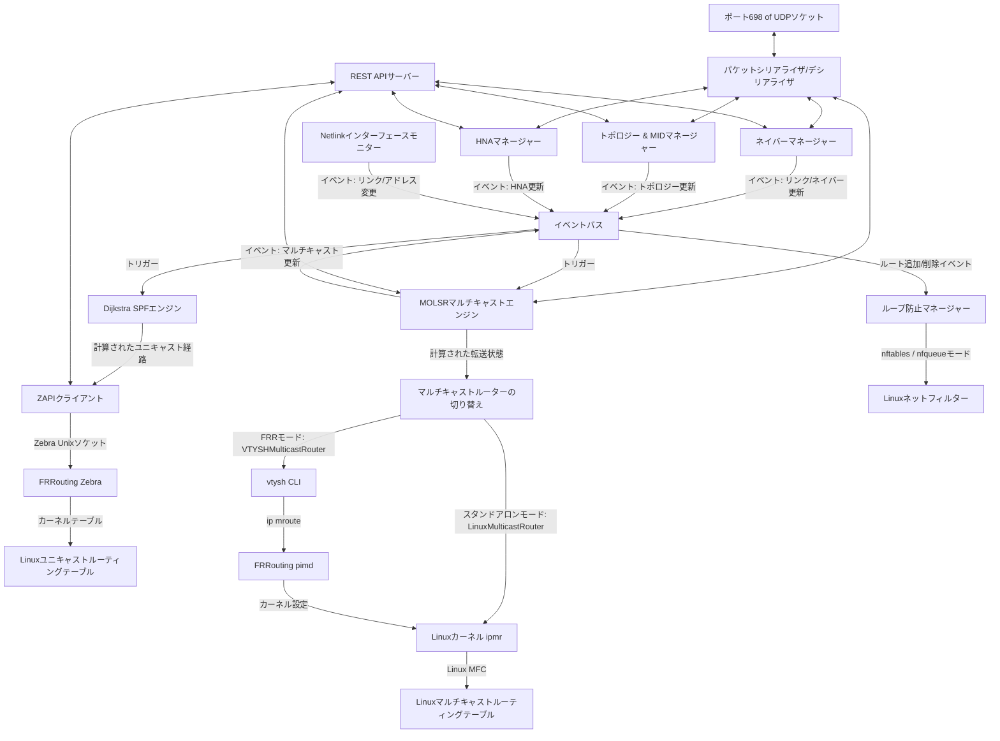

# olsrd-go: Go言語によるOLSRルーティングデーモン

[](https://pkg.go.dev/github.com/sh0jitmy/olsr-go)
[](https://github.com/sh0jitmy/olsr-go/actions/workflows/ci.yml)
[](https://goreportcard.com/report/github.com/sh0jitmy/olsr-go)
[](LICENSE)
[](go.mod)

`olsrd-go` は、アドホックネットワークおよびメッシュネットワーク向けの **Optimized Link State Routing Protocol (OLSR)** (RFC 3626) のGo言語実装です。ユニキャスト経路伝搬のための **FRRouting (FRR) Zebra** との統合、およびマルチキャスト転送キャッシュ管理（MOLSR）のための直接的なLinuxカーネルプログラミング機能を備えています。

---

## システムアーキテクチャ

本デーモンはイベント駆動型の設計を採用しており、インメモリのイベントバスを介して各サブシステムが通信します。サブシステムとそれらの相互作用の概要は以下の通りです。



---

## 主要なルーティングコンセプトと論理構造

### 1. ユニキャストルーティング

- **リンクセンシング (Link Sensing)**: `HELLO` パケットを定期的にブロードキャストして1ホップのネイバーを検出し、リンク状態（対称/非対称リンク）を確立します。
- **MPR選択 (MPR Selection)**: マルチポイントリレー（MPR）を動的に選択します。各ノードは、対称的な2ホップネイバー全員をカバーできるように、対称的な1ホップネイバーの中から最小のサブセットを選択します。このサブセットが、トポロジー制御メッセージの重複転送を抑制しつつフラッディングを処理します。
- **トポロジー制御 (TC) および MID**: リンク状態情報は `TC` メッセージでフラッディングされます。複数インターフェースを持つノードは `MID` メッセージでアドレスのバインド情報を通知します。外部ゲートウェイは `HNA` メッセージを使用して外部ネットワークを広告します。
- **SPFエンジン**: ダイクストラ法を用い、トポロジーデータベースの対称的なリンクに基づいて最短経路木を計算します。内部のメッシュノードと外部のHNAネットワークの両方への経路が生成されます。
- **ZAPI統合**: 計算された経路は、ZAPI v6ヘッダーを使用してUnixドメインソケットを介してFRRouting Zebraに通知されます。デーモンは、OLSR SPF計算から取得した経路に管理距離（Administrative Distance） `150` を付与して広告し、標準的なカーネル上書きルールを適用します。

### 2. マルチキャストルーティング (MOLSR)

`olsrd-go` は、`draft-jacquet-olsr-molsr-00.txt` に記載されているマルチキャストルーティング拡張機能を実装しています。

- **ツリーの構築**:
  1. マルチキャスト送信元が `SOURCE CLAIM` パケットをフラッディングします。
  2. 受信ノードは、ユニキャストSPFツリーに基づいて送信元方向への次のホップ（親ノード）を決定し、その次のホップに対して `CONFIRM PARENT` パケットをユニキャストで送信します。
  3. 自分自身を親ノードとして指定する `CONFIRM PARENT` を受信した中間ノードは、その子ノードへのインターフェースを登録し、さらに上流へ登録を転送することで、送信元を根とする配信ツリーを形成します。

- **マルチキャストルーターの抽象化と FRRouting との共存**:
  Linuxカーネルの仕様上、マルチキャストルーティングソケット（`MRT_INIT`）を初期化して所有できるプロセスはシステム全体で1つのみです。このため、`olsrd-go` と FRR の `pimd` を同時に起動すると、直接カーネルを操作する際に競合が発生します。この競合を解決するため、以下の抽象化レイヤーを設けています。
  - **スタンドアロンモード (Linuxカーネル直接制御)**: FRRを使用しない場合、`olsrd-go` が自身でマルチキャストソケットを初期化 (`MRT_INIT`) し、生のIGMPソケットの `setsockopt` 呼び出し (`MRT_ADD_MFC`/`MRT_ADD_VIF`) を用いて、Linuxカーネル의 マルチキャスト転送キャッシュ（MFC）を直接制御します。
  - **FRR連携モード (VTYSH制御)**: FRRと共存する場合、`pimd` がマルチキャストソケットを保持します。`olsrd-go` は直接カーネルを操作せず、`vtysh` CLIコマンドを実行して `pimd` のコンテキスト下で静的なマルチキャストルート (`ip mroute <oif> <grp> <src>`) を登録することで、経路制御を `pimd` に委ねます。また、起動時に監視対象のインターフェースで PIM を有効化 (`ip pim`) し、`pimd` がそれらを仮想マルチキャストインターフェース（VIF）として認識できるようにします。

- **マルチキャストループ防止機能 (無線-to-無線中継)**:
  無線アドホック・メッシュネットワーク環境では、マルチキャストパケットを受信した物理インターフェースと同一のインターフェースから送信（無線-to-無線の中継、いわゆるヘアピン転送）する必要が頻繁に生じます。しかし、通常のL3マルチキャストルーティングでは以下の問題があります。
  - 標準的なL3マルチキャストおよびルーティングデーモン（`pimd`など）の仕様上、入力インターフェース（IIF）と出力インターフェース（OIF）が同一となるルートはループ防止ポリシー（Split Horizonなど）により拒否またはドロップされます。
  - `vtysh` で静的ルートを強制的に設定した場合でも、無線という共有媒体の性質上、隣接ノードが中継した重複パケットを自身が再び受信して再転送してしまい、無限パケットループ（重複パケットの氾濫）が発生します。

  この問題を解決するため、`olsrd-go` はL2（MACアドレス）レベルのフィルタリングメカニズムを実装し、MOLSRツリー上で「親ノードとして認めた特定の隣接ノード」から送信されたパケットのみを受理し、それ以外の重複した中継パケットを破棄します。
  - **`none` モード**: ループ防止フィルタリングを行いません。
  - **`nftables` モード**: `/proc/net/arp` から解決した親ノードのMACアドレスをもとに、`nftables` の `prerouting` チェーンに動的なMACフィルタールールを生成します。親ノードのMACアドレスからのマルチキャストパケットのみを許可し、他をドロップします。
  - **`nfqueue` モード**: Netfilter queue (`NFQUEUE`) を使用してマルチキャストパケットをユーザー空間（Go）に転送します。純粋なGo言語の Netfilter Netlink ライブラリを用いて、パケット受信時のハードウェアメタデータ（`NFQA_HWADDR`）を解析し、親ノードのMACアドレスと合致するパケットのみを許可（`NF_ACCEPT`）し、重複パケットを破棄（`NF_DROP`）します。外部CLI（`nft` コマンドなど）を実行するオーバーヘッドがなく、軽量に処理できます。

### 3. スタンドアロンルーティングモード (Standalone Mode)

`olsrd-go` は、起動時に `--standalone` コマンドライン引数を指定するか、設定ファイルで `standalone: true` を指定することで、**スタンドアロンモード**で動作させることができます。このモードでは FRRouting Zebra との連携（ZAPIクライアント）を完全にバイパスし、ネットリンクプロトコル（`github.com/vishvananda/netlink`）を使用してユニキャスト経路を Linux カーネルのルーティングテーブルに直接追加・削除します。マルチキャスト（MOLSR）に関しては、Zebraモード時と同様に生の IGMP ソケット（`ipmr`サブシステム）を介して直接カーネルへ設定されます。

---

## テストと検証

### 1. ユニットテスト

ユニットテストは、外部依存関係なしで独立したコンポーネント（ネイバー状態の遷移、ダイクストラグラフ計算、パケットのシリアライズ/デシリアライズ）を検証します：

```bash
make test
```

### 2. Docker結合テスト

結合テストスイートは、隔離されたネットワークトポロジーでユニキャスト経路の伝搬とマルチキャストMFCプログラミングを検証します。

#### トポロジー環境
- **ペア 1**: `r1` (`10.10.1.10`) と `r2` (`10.10.1.20`)。サブネット: `10.10.1.0/24`
- **ペア 2**: `r3` (`10.10.2.30`) と `r4` (`10.10.2.40`)。サブネット: `10.10.2.0/24`
- **ループバックIP**: `lo` インターフェースには、`pimd` が仮想マルチキャストインターフェースとして認識できるように loopback IP (`10.10.100.X/32`) が設定されます。
- **起動デーモン**: 各コンテナサービスはFRR Zebraデーモンと `olsrd-go` を実行します。FRR連携モードでは、FRRoutingのマルチキャストルーティングデーモンである `pimd` が有効化され `MRT_INIT` を保持し、`olsrd-go` は `vtysh` を介して静的マルチキャストルートを登録します。スタンドアロンモードでは、`pimd` は無効化され、`olsrd-go` が直接 `MRT_INIT` を管理します。

#### 結合テストの実行 (Zebra連携モード)
```bash
make integration-test
```

#### スタンドアロン結合テストの実行 (直接カーネル制御モード)
FRRouting Zebraを使わず、Linux Netlinkおよび raw IGMP ソケット経由でカーネルのユニキャスト/マルチキャストルーティングを直接プログラムするスタンドアロンモードをテストするには、以下を実行します：
```bash
make standalone-test
```

#### 検証・インジェクションツール

コンテナを起動した状態で、手動クエリの送信やテストデータのインジェクションを行うためのGoプログラムが `test/integration/tools/` 配下に用意されています。これらのツールは、デフォルトの結合テスト構成に対応したJWTトークンを使用して自動的に認証を行います。

- **ネイバー確認 (`check_neighbors`)**: 4つのルーターAPIインスタンスすべてに対してクエリを送信し、現在のOLSRネイバー情報を出力します。
  ```bash
  go run test/integration/tools/check_neighbors/main.go
  ```
- **ユニキャストHNAのインジェクション (`inject_hna`)**: `r1` にHNAプレフィックス (`192.168.10.0/24`) を挿入し、6秒間待機したのち、`r2` のローカル/リモートHNAデータベースおよびルーティングテーブルをクエリします。
  ```bash
  go run test/integration/tools/inject_hna/main.go
  ```
- **マルチキャストルートのインジェクション (`inject_mcast`)**: `r1` にマルチキャスト SourceClaim を登録し、`r2` で ConfirmParent 上流ルートを設定したのち、`r2` のアクティブルート情報とカーネルのマルチキャスト転送キャッシュ (`ip mroute show`) を確認します。
  ```bash
  go run test/integration/tools/inject_mcast/main.go
  ```
- **ペア2の経路伝搬テスト (`test_r3_r4`)**: `r3` にHNAプレフィックス (`192.168.20.0/24`) を挿入し、6秒間待機して経路が伝搬したことを確認したのち、`r4` のカーネルルーティングテーブルを確認します。
  ```bash
  go run test/integration/tools/test_r3_r4/main.go
  ```

#### 手動での検証手順

ルーティングテーブルとデーモンのステータスを手動で検査する手順：

1. **コンテナを起動する**:
   ```bash
   cd test/integration
   docker compose up -d
   ```

2. **ユニキャスト経路の確認**:
   - REST API（JWTトークンで保護）を介して `r1` にHNAプレフィックスを挿入します：
     ```bash
     curl -X POST -H "Authorization: Bearer <TOKEN>" -H "Content-Type: application/json" \
       -d '{"prefix":"192.168.10.0/24"}' http://localhost:8081/api/v1/hna
     ```
   - `r2` の内部でルーティングテーブルをチェックし、Zebra経由で経路が伝搬されインストールされたことを確認します：
     ```bash
     docker exec olsr-int-r2 ip route show 192.168.10.0/24
     ```
     *期待される出力:* `192.168.10.0/24 via 10.10.1.10 dev eth0 proto zebra metric 20`

3. **マルチキャストMFCプログラミングの確認**:
   - `r1` に SourceClaim を投稿し、`r2` に親ノード確認を登録します：
     ```bash
     curl -X POST -H "Authorization: Bearer <TOKEN>" -H "Content-Type: application/json" \
       -d '{"source":"10.10.1.10","group":"239.2.2.2","duration_seconds":60}' http://localhost:8081/api/v1/molsr/source-claims

     curl -X POST -H "Authorization: Bearer <TOKEN>" -H "Content-Type: application/json" \
       -d '{"source":"10.10.1.10","group":"239.2.2.2","parent":"10.10.1.10","child":"10.10.1.20","duration_seconds":60}' http://localhost:8082/api/v1/molsr/confirm-parents
     ```
   - `r2` の内部でカーネルマルチキャスト転送キャッシュをクエリします：
     ```bash
     docker exec olsr-int-r2 ip mroute show
     ```
     *期待される出力:* `(10.10.1.10, 239.2.2.2) Iif: eth0 State: resolved`

4. **コンテナのクリーンアップ**:
   ```bash
   docker compose down -v
   ```

---

## ライセンス

本プロジェクトは Apache License 2.0 のもとでライセンスされています。詳細は [LICENSE](LICENSE) ファイルを参照してください。
